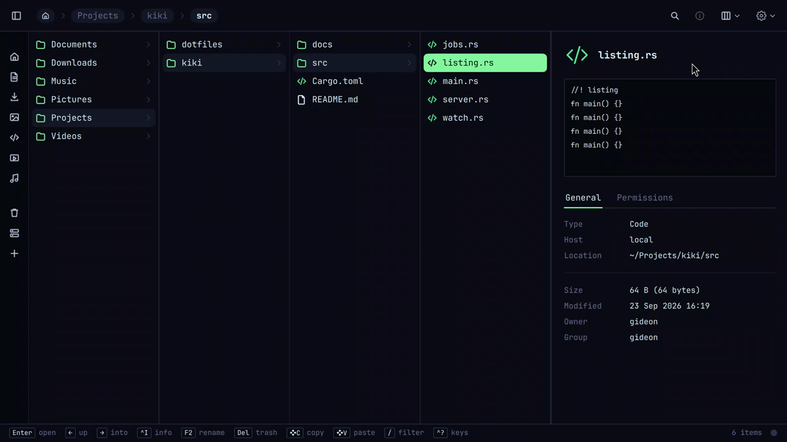

# kiki

<p align="center">
  
</p>

A fast file manager for [Omarchy](https://omarchy.org). A Rust daemon does the work; a
Quickshell front end draws it. List, icon, column and gallery views; an info panel; SFTP, FTPS and
SMB locations side by side with your local folders; one-way mirroring with a review before it runs;
search over a name index; git badges; project mode beside your editor and agent; sharing by mail
and Taildrop; and "Open AI here…", which starts the AI you use in Omarchy in a terminal beside your
files.

## Install

On Arch / Omarchy, from the latest release:

```
curl -fsSL https://raw.githubusercontent.com/greyhorsesoftware/Kiki/main/install.sh | bash
```

It fetches the package for your architecture, checks its sha256 and hands it to `pacman -U`. Run
it again to upgrade. Or take the package from the Releases page and `sudo pacman -U` it yourself.

kiki starts from the app launcher or with `kiki`. It changes nothing system-wide on its own:
making it your folder handler and file chooser is offered by its first-run dialog, per user, and
undone from Settings → Omarchy.

## Keys

The defaults; the shortcuts window (`Ctrl+?`) rebinds them.

| | |
|---|---|
| Find | `/` filter this folder · `Ctrl+Shift+F` search everywhere · `Ctrl+L` type a path · `Ctrl+Shift+L` add a location |
| View | `Ctrl+1` icons · `Ctrl+2` list · `Ctrl+3` columns · `Ctrl+4` side by side · `Ctrl+5` gallery · `Ctrl+H` hidden files · `Ctrl+I` info panel · `Ctrl+B` favorites · `Ctrl+,` settings |
| Files | `Super+C` copy · `Super+X` cut · `Super+V` paste · `Ctrl+Shift+N` new folder · `F2` rename · `Del` trash · `Ctrl+Z` undo · `Alt+Enter` open · `Alt+Shift+Enter` open with… · `Alt+S` share · `Alt+Q` open AI here |
| Two panes | `Ctrl+M` mirror · `F6` move across · `Ctrl+Shift+P` project mode |

## Locations

Add a server from the sidebar's `+` or `Ctrl+Shift+L`. Opening it goes side by side — the server
on the right, your folder on the left — and `Ctrl+M` mirrors one onto the other after a review
of exactly what would change. Passwords go to the keyring; nothing is sent anywhere else.

## Develop

```
make            # build the daemon and the plugins
make run        # a daemon against this checkout and a shell on top of it
make test       # clippy, then the Rust, QML and end-to-end suites
make dev-clean  # forget the checkout's own settings, cache and index
```

`make run` keeps to itself: its socket is `kiki-dev.sock` and everything it writes — settings,
locations, the journal, the cache, thumbnails, the search index — goes under
`~/.local/state/kiki-dev/`, never into the installed kiki's folders; Settings › Omarchy's Apply
edits a scratch home there too. Only the trash is shared: a file trashed is trashed.

The end-to-end flows drive the real shell under `cage`; the ones that need a server (`openssh`,
`vsftpd`, `samba`) skip by name when it is not installed. `cd packaging && makepkg -fi` builds
and installs the package from a checkout.

The plans under `docs/0.1.0/` are the design and the record — `CORE.md` is the map,
`31-final-implementation-plan.md` the order of events — and `API-DAEMON.md` / `API-PLUGIN.md`
are the two wire protocols. `docs/0.2.0/` is what comes next.

MIT — see `LICENSE`.
