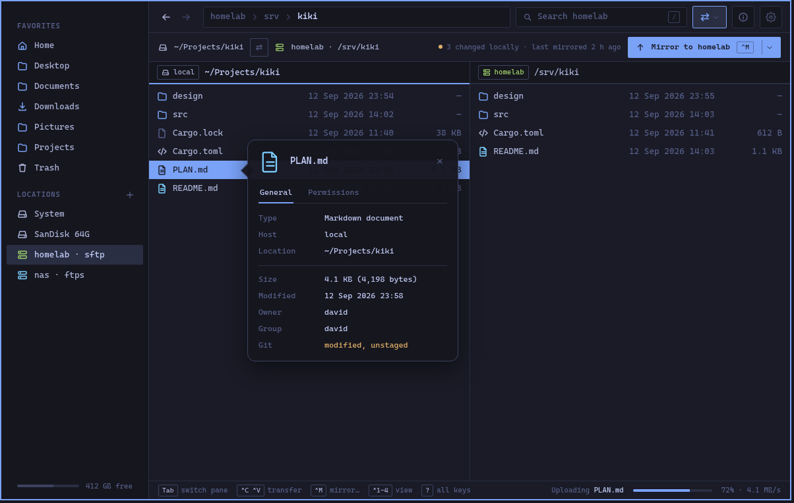
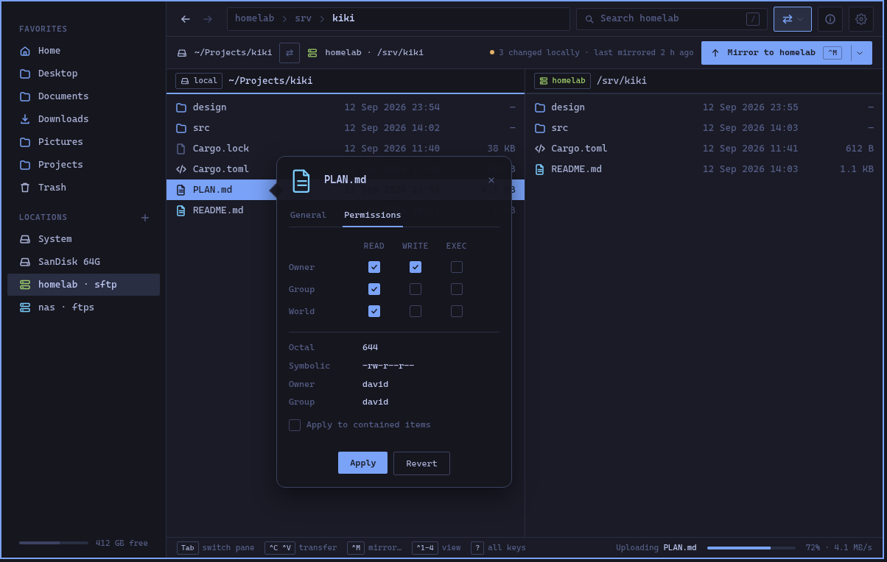
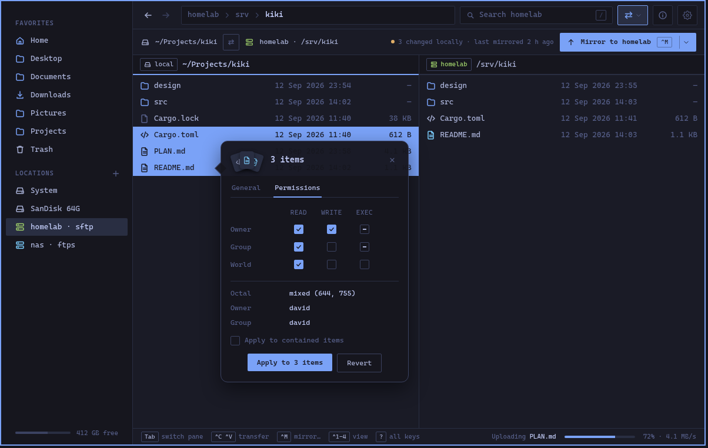
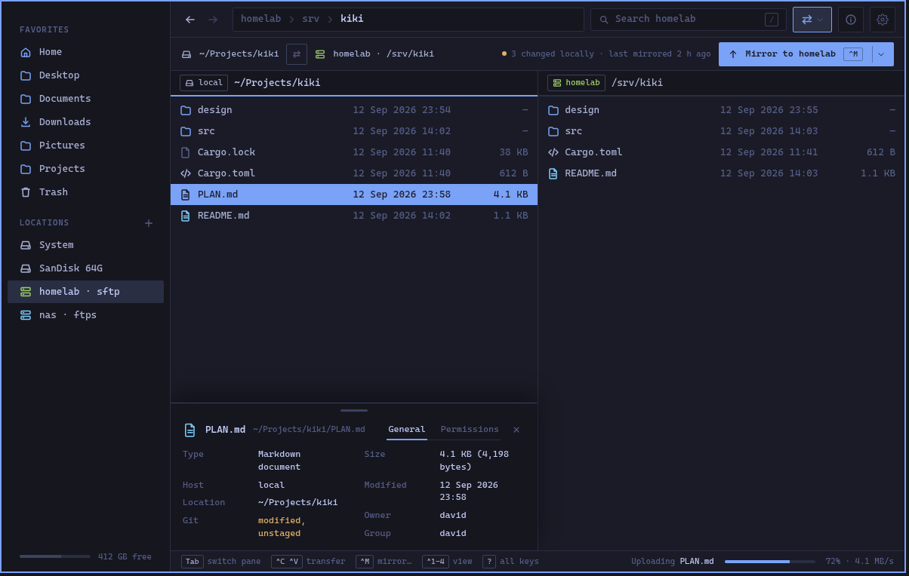
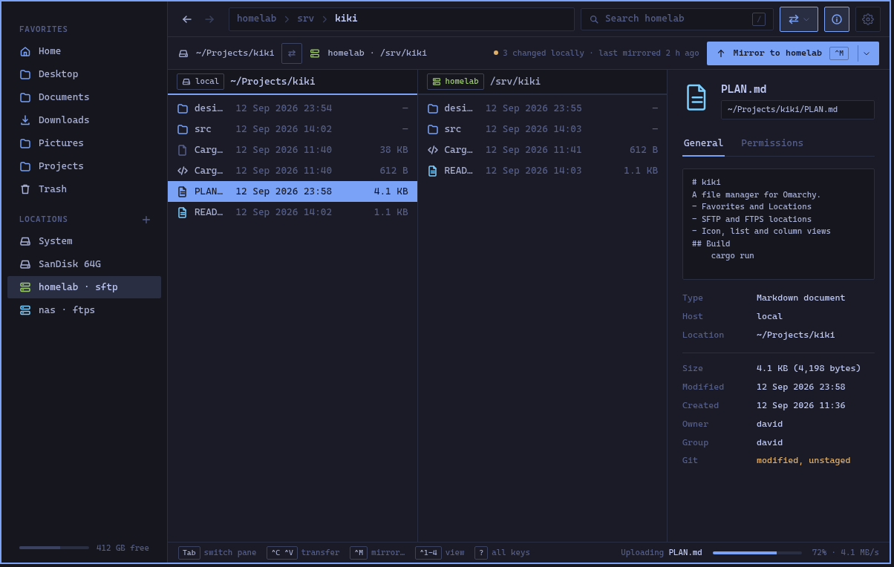
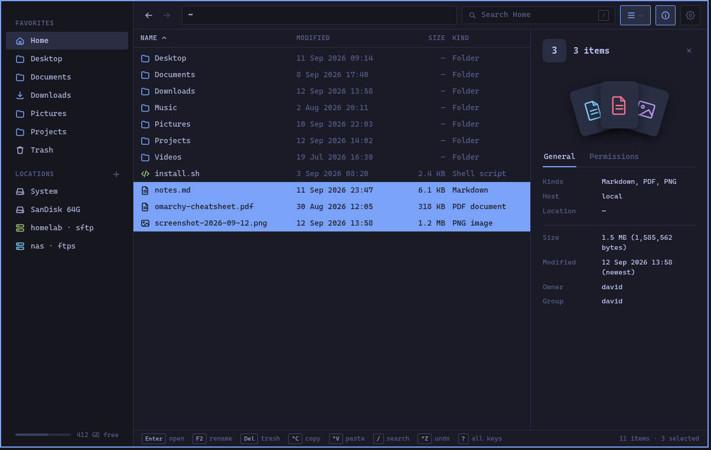

# 01 — The info popover, and the info panel over a selection (0.1.1)

**Status:** **done 2026-09-24** (planned the same day: "an overlay popup, General and Permissions only"; "the standard info panel supports N files too"). As built: `ui/InfoPopover.qml` hosts the panel's own `Inspector` in a new `compact` shape (no preview, no grip, tighter header, `naturalHeight`) on a Frost card with the activity popover's pointer on its left edge, aimed at the focused view's `rowItem(selection.current)` and re-aimed on a beat while up; `Shell` shows it for `split && inspector && view !== columns` and keeps the docked slot to `!split` (the off-screen defect); Escape, Ctrl+I and an outside click close it. The selection face is `Inspector.rows` (count, `KindFan` — the panel's preview slot and, small, the card's header — `kindsSummary`, `sizeSummary`, newest Modified, `common(owner|group)`, git counts, the tri-state grid over `touchedMask`/`touchedBits`, "Apply" → `chmodMany(mask, bits, recursive)`; Revert is a mark at the grid's right rather than a button — dim until a box is changed, lit once one is; owner, 2026-09-24 — that puts the grid back to what it showed when the card opened and sends nothing; in the card Owner and Group share one line on both tabs, and "Apply to contained items" and Apply are centred in the card and the panel alike — owner, 2026-09-24), shared by the docked panel, the card and the columns' info column; the daemon's `chmod` op takes `items` + `mask`/`bits` (one job, `chmodList` inverse of each item's prior mode, carrying on past an item it cannot change — `docs/0.1.1/API-DELTA.md`). `IconPane` gained `rowItem` so the pointer aims in the icon view too. Deviation from the text below: with nothing selected the card does not show (`inspector` needs a file, as the docked panel does — the toolbar dims the same way), rather than showing the folder. Tests: `tst_InfoPopover` (new, 6), `tst_InspectorSelection` (new, 7), `tst_ColumnsPane` (the info column over a selection), the three daemon tests, and the `side_by_side` e2e section (which presses the real Escape).

## The defect this fixes

In side by side, Ctrl+I is offered (the View menu's "Show info" is enabled, the key fires) and
does nothing you can see. `Shell.qml` subtracts the panel's width from the pane only when the
window is *not* split (`leftCol.width`, ~line 1300), while the panel's slot at the end of the
pane row still takes its full width — so the panel is laid out past the window's right edge.
It opens, invisibly, and stays "open" until the next Ctrl+I. Found making the demo video.

## Decision

A docked panel is the wrong shape for two panes: it either narrows both (a third column) or
narrows the one whose file it is (docked in the pane), and at the window widths side by side
is used at — two panes in 1200 logical pixels — neither leaves a list worth reading.

So in side by side the file's details come up as a **callout beside the selected row of the
focused pane**: a card with a pointer on the row, the way the activity popover points at the
orb (owner, 2026-09-24), with **General** and **Permissions** only — **no preview**. Nothing
else moves. It follows the focused pane's selection while it is up — the card slides to the
row — and goes on Ctrl+I, Escape, or a click anywhere outside it. The single-pane window
keeps the docked panel exactly as it is; the columns view keeps its info column.

(`docs/design/InfoPopover.dc.html`, `InfoPopoverPermissions.dc.html`, `InfoPopoverMulti.dc.html`;
`python3 gen.py <name>…` regenerates them.)

## The two other shapes, mocked up (owner, 2026-09-24)

**A sheet up from the bottom of the focused pane** — the pane's full width, about 240 px tall,
the fields in two columns, tabs on the header line. The other pane and the pane's own header
are untouched; the list keeps its full width and loses its lower third.

**The panel slid in from the right, both panes kept** — the panel as it is today, preview and
all, as a third column. Nothing new to build beyond the layout fix; both panes give up a third
of their width, and at 1200 px the names in both are already elided.

(`InfoSheet.dc.html`, `InfoSide.dc.html`.)

| | Popover (card) | Sheet (bottom) | Panel (right) |
|---|---|---|---|
| Rows still readable | all but the ones under the card (~6) | the top two thirds | all, but names elided in both panes |
| Which pane's file | obvious: it points at the row | obvious: it is part of it | by content only |
| Preview | none | none (no height for one) | yes, as today |
| Permissions grid | as today (320 px) | as today, room to spare | as today |
| What moves when it opens | nothing | the pane's rows are covered, not moved | both panes narrow |
| New code | `Inspector.compact` + a popover host | `Inspector.compact` + a two-column layout of the fields + a sheet host | the layout fix |
| Feels like | Quick Look | a drawer | the single-pane window, squeezed |

The card keeps the most of the list and says whose file it is; the sheet keeps the list's
width, which matters for long names, at the cost of its bottom; the right panel is the least
work and the least room. The recommendation stays the card; the sheet is the runner-up if the
covered rows prove to be the rows one wants to see (the selection is usually near the middle).

## Behaviour

- **Opens** with Ctrl+I, the View menu's "Show info", or the context menu's "Get info" — in
  side by side, all three open the popover instead of the panel. Toggling: Ctrl+I again closes.
- **Where** (amended 2026-09-24, owner: "right of the selection, so the arrow points
  correctly"): **beside the pane the row is in, off the row itself** — 12 px to the pane's
  right when there is room for the 320 px card there, else 12 px to its left with the pointer
  on the card's other edge, so the right pane's card sits over the left pane. The pointer then
  touches the row's end instead of sitting inside its highlight. Its top sits 46 px above the
  row's centre so the pointer is on the row, and it slides with the selection (arrow keys, a
  click) the way the activity popover's pointer slides along its edge to stay on the orb.
  Clamped: never above the pane's top or below the window's bottom, and when the row is near
  the bottom the card sits above its natural place and the pointer moves down the edge to stay
  on the row. Never taller than the window: the General tab's field list scrolls if it has to.
  A selected row scrolled out of view takes the pointer with it: the card stays, pinned to the
  pane's top, and the pointer hides until the row is back. The card is near-opaque (Frost at
  0.96): it is read, not seen through, and what is under it is the other pane.
- **What it shows**: the header (kind icon, name, path) and the two tabs, the same `Inspector`
  fields as today. General: Type, Host, Location; Size, Modified, Owner, Group; Git, Branch, Last
  commit when there is a repository. Permissions: the grid, Octal, Symbolic, Owner, Group,
  "Apply to contained items", Apply. **No Open / Open with… buttons and no key hints** (owner,
  2026-09-24): Enter and the context menu open a file from the list, which is right there.
  **No preview**: it is a card over a list, and
  a picture or a page of text in it would cover what the list is for; the single-pane panel and
  the gallery are where a file is looked at.
- **Follows the selection** of the focused pane, and the focus: Tab to the other pane and the
  card moves over that pane and shows its selection. With nothing selected it shows the folder
  itself (as the panel does), pointing at the pane header — never an empty card.
- **Multiple selection** (below): the card counts, sums and merges, and points at the row the
  keyboard is on.
- **Closes** on Ctrl+I, Escape, a click outside the card, leaving side by side, or the mirror
  workspace opening. The tab it was on is remembered for the session, as the panel's is.
- **Keyboard** while it is up: the pane keeps the keyboard — arrows move the selection and the
  card follows. Tab switches panes. The card takes no focus of its own except the Permissions
  grid's checkboxes when clicked; Apply runs the chmod job as the panel does.
- **Resizing**: none. 320 px is the panel's `minWidth` (the Permissions grid) plus margins; a
  popover that can be dragged wider over a list is not a popover.
- **Frost**: the card is `Frost` over the pane, like the activity popover — the rows under it
  show through, blurred, so it reads as something over the list and not a hole in it.

## Multiple selection

The panel today shows the *current* row only, whatever is selected. The card shows the
selection:

- **Header**: a **little fan** of the kinds' icons in place of the one icon (the panel's fan at
  header size, three cards at most), then "3 items". Where the selection spans more than one
  folder (search results, the trash) the Location field says so: "2 folders".
- **General**: Kinds ("2 Markdown documents, 1 Code" — kinds counted, the two commonest named,
  "and 3 more" past that), Host, Location; Size as the sum of what is known, with the count of
  folders whose size is not known appended ("5.8 KB, 2 folders unmeasured"); Modified as the
  newest, marked "(newest)"; Owner and Group when they are the same for all, "mixed" otherwise;
  Git as counts ("1 modified, 2 clean"), the colour of the worst state.
- **Permissions**: the same grid with a **third state** — a dash — for a bit that differs
  across the selection; Octal reads "mixed (644, 755)". Clicking a mixed box sets it for all;
  clicking a set box clears it for all. **Apply** (just that — the header says how many; owner, 2026-09-24) applies only the bits you touched
  and leaves the others as each file has them: **one chmod job for the selection** (owner,
  2026-09-24) carrying the items, a mask and the bits, the daemon merging them into each file's
  own mode — one activity entry, one undo; a file it cannot change is reported and the rest go
  on, as a copy does past a file it cannot read. "Apply to contained items" as now.
- **The pointer** is on the current row — the one the keyboard is on, the last one chosen by a
  click — and moves with it; the selection as a whole does not move the card.
- **What it reads**: the rows' `meta`, which the listing already holds for the window's rows,
  so nothing is asked of the daemon. A selection wider than the loaded window (select all in a
  folder of 100,000) counts what the listing knows ("100,000 items"), and sums only what has
  metadata, saying so: "12.4 MB of 2,000 measured".
- **The docked panel, the same** — a requirement, not a side effect (owner, 2026-09-24): the
  single-pane window's panel and the columns view's info column show the selection exactly as
  the card does, since it is `Inspector` code. The one difference is the preview box, which
  the panel has and the card does not: over a selection it shows the **kinds** in it as a
  **fan** — the kind icons overlapping like a hand of cards, each on a small card of the
  panel's darker ground, the current row's on top, up to five with "+n" on the last for
  more — with **no box or border** around it, and nothing plays. Open and Open with… are for one file; over
  a selection they are not offered (Enter opens the selection from the list, as always).
  The panel was single-row; a selection of one looks exactly as it did.

(`docs/design/InfoPanelMulti.dc.html`.)

## Implementation

- `qml/kiki/ui/InfoPopover.qml`, new: an `Item` filling the pane row like `ActivityPopover`
  (outside-click MouseArea, `z: 60`, the same `Frost` card and the same rotated-square pointer,
  on the left edge instead of the bottom), holding one `UI.Inspector` with a new `compact: true`
  property that hides the preview box and the resize grip and draws the header tighter. The
  `Inspector` stays the one component: fields, git lines, the permissions editor and the chmod
  signal are not duplicated. The row to point at comes from the view's `rowItem(index)` (what
  `rowGeometry` uses), mapped to the pane row; the card re-aims on `pos`/scroll changes.
- `Inspector` gains `rows: []` beside `row`: one row is what it shows today; several are the
  merged face above (`Kiki.Format` gets `kindsSummary(rows)`, `sizeSummary(rows)`). The chmod
  signal carries `(mask, bits, recursive)` for a selection and `(mode, recursive)` for one file;
  the shell submits the first as one `chmod` job with `items`, `mask` and `bits`, and the daemon's
  chmod op learns the masked form (today it takes one `uri` and a `mode`); its inverse is the
  list of each item's mode before, so one undo puts them all back.
- `Shell.qml`: `inspectorSlot.shown` becomes `!win.split && view !== "columns" && win.inspector`
  (the layout bug is fixed by the same line), and `win.inspector && win.split` shows the
  popover. `inspectedUri` / `inspectedRow` already follow `win.pane`'s selection; the popover
  binds to them and to `win.pane === win.right` for which pane to sit over. The View menu's
  "Show info" is enabled in side by side as now; its label is the same.
- State and IPC: `state().inspector` stays what it is (requested and a file to show);
  `state()` gains `infoPopover: bool`, and `geometry("info-popover")` for the tests.
- Settings: none new. The remembered tab is `Kiki.Settings.view.inspectorTab`, shared with the
  panel.

## Tests

- `tests/qml/tst_InfoPopover.qml` (new): opens over the focused pane and not the other; follows
  a selection change and a pane switch; Escape, Ctrl+I and an outside click close it; nothing
  selected shows the folder; the pane row's widths do not change while it is up (the defect);
  no preview element exists in it; Apply on the Permissions tab emits the chmod with the mode;
  the pointer's y is the selected row's centre, moves with the selection, hides when the row
  scrolls out, and the card stays inside the pane at the top and bottom rows; with three rows
  selected the header counts them, Size is the sum, Owner is "mixed" when it is, a differing
  bit shows the dash, and Apply emits one chmod per item with only the touched bits.
- `tst_SideBySide`: Ctrl+I in split no longer changes the panes' widths (the regression test for
  the off-screen panel).
- `tst_Inspector` (the docked panel, existing file): with three rows the header counts, the
  preview box shows the kinds and no image or video, Kinds/Size/Modified/Owner are the merged
  values, Open is absent; the Permissions grid shows the dash for a differing bit and Apply
  emits one chmod per item with the touched bits only; back to one row, everything as before.
- `tst_ColumnsPane`: the info column over a multi-selection in the last column shows the count.
- `tests/e2e/flows/side_by_side.py`: one section — select a file on the left, Ctrl+I, the
  popover's geometry is inside the left pane; Tab; it is inside the right pane; Escape closes.

## Size

| | Days |
|---|---|
| `Inspector.compact`, `InfoPopover.qml` with its pointer, the Shell wiring | 1 |
| Multiple selection in `Inspector` — the card, the docked panel and the columns' info column alike (merged fields, the kinds box, tri-state grid, per-item chmod) | 1½ |
| Tests | 1 |

## Decisions wanted

| | Question | Recommendation |
|---|---|---|
| D1 | Follow the selection, or freeze on the file it was opened for? | Follow. That is what the panel does, and a card that stops following is a card you have to close and reopen for every file. |
| D2 | Frost, or a solid card? | Frost. It is the house style for things over content (activity, menus), and it says "over" rather than "instead of". |
| D3 | Also offer the popover in the single-pane window, as a lighter alternative to the panel? | No. One way per layout; the panel is right where there is room for it. |
| D4 | Card, sheet, or right panel (the three mockups above)? | **Card** (owner, 2026-09-24: "an overlay popup … with a pointer"). |
| D5 | Chmod over a selection: one job per file, or one job for the selection? | **One job for the selection** (owner, 2026-09-24). |
